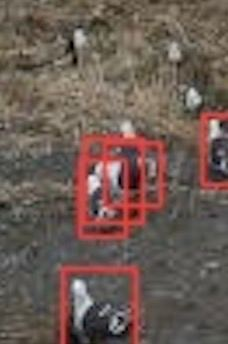
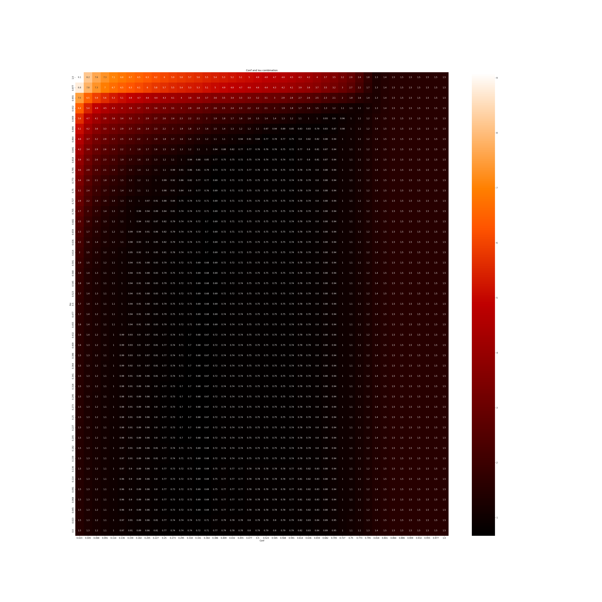

# <b>Hello, I want to say that this is my first hackathon. I really liked this hackathon, because there is a very kind community of participants, good organizers and good helpers</b>

# <b>Now I want to discuss the tactics of my decision</b>

### <b><u>1. Simple enumeration of models, enumeration of batch, different and number of epochs</b></u>
<b>Models:</b>
<ul>
<li>YOLOv5n</li>
<li>YOLOv5s</li>
<li>YOLOv5m</li>
<li>YOLOv5x</li>
<li>YOLOv5x6</li>
</ul>

<b>Batchs:</b>

<ul>
<li>8</li>
<li>10</li>
<li>12</li>
<li>16</li>
<li>32</li>
</ul>

<b>Epochs:</b>

<ul>
<li>100</li>
<li>300</li>
<li>Also using `--save-period`</li>
</ul>

I noticed a certain pattern, the higher the batch, the better the result on the public soon

### <b><u>2. Image analysis with detect.py</b></u>

After analyzing the markup of the boxes for the test and valid datasets, you can notice some peculiarity that very often the model creates phantom boxes and one seagull can be marked several times. 

In order to fight this, you need to pick up the perfect iou and conf

The conf parameter (short for confidence) is responsible for the confidence threshold, which determines how confident the model is that the detected object is actually present in the image.

IoU (Intersection over Union) is a metric used to evaluate the quality of object detection in an image. It is defined as the ratio of the area of ​​intersection between the predicted and true objects to the area of ​​the union of these objects.

To do this, you need to choose the perfect conf and iou
1. The first idea was to pick the best conf and then match iou to it
2. The final idea was to enumerate all combinations of conf and iou

P.S Sorry for the terrible colorizer, I forgot to invert the colors

### <b><u>3. Creating Predict Ensembles</u></b>

To improve the result, I implemented an ensemble of predictors:
1. Take the most popular value of the number of gulls from all predicts
2. Take the arithmetic mean of the number of seagulls from all predicts
3. Take the weighted average of all predicts

The best idea was to calculate the arithmetic mean of all the predict

### <b><u>4. The evolution of hyperparameters</b></u>

The evolution of yolov5 hyperparameters is a technique that allows automatic tuning of the hyperparameters of a YOLOv5 model using optimization algorithms. This method allows you to determine the optimal values ​​of hyperparameters for a specific problem and dataset, which can significantly improve the performance of the model.

For my task, I chose 25 epochs, 300 generations, YOLOv5x and 10 batch. Unfortunately, this did not give great results, since this process is very laborious. Unfortunately, this did not give great results, since this process is very laborious.

### <b><u>5. Dataset extension</u></b>

In order to increase the result, you can increase the dataset Roboflow is perfect for this.

I chose to zoom in on the images by 3x, also increase the brightness of some images by 20%, mirror the image and blur.

### <b><u>6. Removing extra seagulls</u></b>

I wrote a function that iterates through all the boxes and removes them if they are smaller than 5 by 5 pixels, unfortunately, the model did not highlight such seagulls and the function was not needed